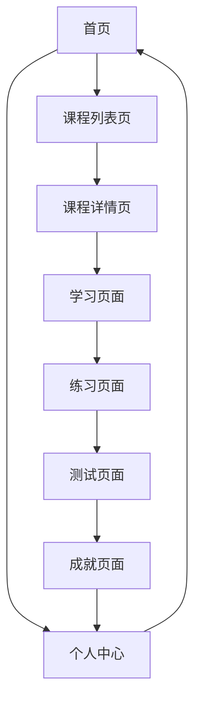

## 1. Product Overview
数据分析在线教育平台，专为商务数据分析与应用专业学生设计，提供完整的学习体验。
- 提供分级课程体系、互动式学习模块、学练测评一体化功能和成就激励系统
- 目标用户为商务数据分析专业学生，帮助他们掌握数据分析技能并应用到实际业务中

## 2. Core Features

### 2.1 User Roles
| 角色 | 注册方式 | 核心权限 |
|------|---------------------|------------------|
| 普通用户 | 邮箱注册 | 浏览课程、学习内容、完成练习和测试、查看成就 |
| 管理员 | 系统分配 | 管理课程内容、用户数据、成就系统 |

### 2.2 Feature Module
1. **首页**：英雄区、课程推荐、学习进度、成就展示
2. **课程列表页**：课程分类、筛选、搜索功能
3. **课程详情页**：课程介绍、章节列表、学习进度
4. **学习页面**：视频内容、代码编辑器、交互式练习
5. **练习页面**：多种题型、即时反馈、进度追踪
6. **测试页面**：限时测试、评分系统、详细反馈
7. **成就页面**：个人成就、徽章系统、排行榜
8. **个人中心**：学习记录、个人信息、设置

### 2.3 Page Details
| 页面名称 | 模块名称 | 功能描述 |
|-----------|-------------|---------------------|
| 首页 | 英雄区 | 展示平台特色，包含动画效果和主要CTA按钮 |
| 首页 | 课程推荐 | 基于用户兴趣和学习进度推荐相关课程 |
| 首页 | 学习进度 | 展示最近学习的课程和完成情况 |
| 首页 | 成就展示 | 展示用户获得的徽章和成就 |
| 课程列表页 | 课程分类 | 按主题、难度等分类展示课程 |
| 课程列表页 | 筛选功能 | 提供多种筛选条件，如难度、时长、评分等 |
| 课程列表页 | 搜索功能 | 支持关键词搜索课程 |
| 课程详情页 | 课程介绍 | 详细介绍课程内容、目标和适合人群 |
| 课程详情页 | 章节列表 | 展示课程的所有章节和课时 |
| 课程详情页 | 学习进度 | 显示用户的学习进度和完成情况 |
| 学习页面 | 视频内容 | 提供高清视频播放功能 |
| 学习页面 | 代码编辑器 | 集成Python代码编辑器，支持实时运行 |
| 学习页面 | 交互式练习 | 提供与课程内容相关的互动练习 |
| 练习页面 | 多种题型 | 支持选择题、代码题、简答题等多种题型 |
| 练习页面 | 即时反馈 | 提供练习答案的即时反馈和解析 |
| 练习页面 | 进度追踪 | 追踪练习完成情况和正确率 |
| 测试页面 | 限时测试 | 设定测试时间，自动提交 |
| 测试页面 | 评分系统 | 自动评分并生成详细报告 |
| 测试页面 | 详细反馈 | 提供每道题的详细解析和正确答案 |
| 成就页面 | 个人成就 | 展示用户获得的所有成就和徽章 |
| 成就页面 | 徽章系统 | 展示不同等级和类型的徽章 |
| 成就页面 | 排行榜 | 展示用户在平台中的排名 |
| 个人中心 | 学习记录 | 查看历史学习记录和完成情况 |
| 个人中心 | 个人信息 | 管理个人资料和账户设置 |
| 个人中心 | 设置 | 调整平台设置和偏好 |

## 3. Core Process
用户主要操作流程：
1. 用户注册/登录平台
2. 浏览首页推荐课程
3. 选择感兴趣的课程进入详情页
4. 开始学习课程内容，完成交互式练习
5. 参加课程测试，获得评分和反馈
6. 查看个人成就和排行榜
7. 管理个人信息和学习设置

## 4. User Interface Design
### 4.1 Design Style
- 主色调：深蓝色 (#1a365d) 和亮青色 (#4fd1c5)
- 辅助色：橙色 (#ed8936) 用于强调和CTA按钮
- 按钮风格：圆角矩形，有微妙的阴影和悬停效果
- 字体：主标题使用 Inter 字体，正文使用 Roboto 字体
- 字体大小：标题 24-32px，副标题 18-24px，正文 14-16px
- 布局风格：卡片式布局，清晰的视觉层次，充足的留白
- 图标风格：使用 Lucide React 图标库，线条风格，简洁现代

### 4.2 Page Design Overview
| 页面名称 | 模块名称 | UI元素 |
|-----------|-------------|-------------|
| 首页 | 英雄区 | 渐变背景，动态波浪效果，大标题配合简短描述，主要CTA按钮使用橙色突出 |
| 首页 | 课程推荐 | 卡片式布局，每个课程卡片包含封面图、标题、难度、评分和进度条 |
| 首页 | 学习进度 | 环形进度条，显示总体学习情况，搭配简洁的数字统计 |
| 首页 | 成就展示 | 徽章网格布局，每个徽章有独特的图标和颜色，悬停时显示详情 |
| 课程列表页 | 课程分类 | 水平滚动的分类标签，选中状态有明显的视觉反馈 |
| 课程列表页 | 筛选功能 | 下拉菜单和滑块，界面简洁直观 |
| 课程列表页 | 搜索功能 | 搜索框带有图标和自动提示，位于页面顶部 |
| 课程详情页 | 课程介绍 | 大图背景，课程信息分层展示，使用卡片和阴影创造深度 |
| 课程详情页 | 章节列表 | 可折叠的章节列表，每个章节显示完成状态和时长 |
| 课程详情页 | 学习进度 | 顶部进度条，显示总体完成情况 |
| 学习页面 | 视频内容 | 响应式视频播放器，控制按钮简洁现代 |
| 学习页面 | 代码编辑器 | 深色主题代码编辑器，语法高亮，运行按钮突出显示 |
| 学习页面 | 交互式练习 | 与课程内容紧密集成，实时反馈和提示 |
| 练习页面 | 多种题型 | 不同题型有不同的视觉样式，保持整体一致性 |
| 练习页面 | 即时反馈 | 正确答案显示绿色，错误答案显示红色，带有详细解析 |
| 练习页面 | 进度追踪 | 顶部进度条，显示当前完成情况 |
| 测试页面 | 限时测试 | 倒计时器位于顶部，时间紧迫时颜色变为红色 |
| 测试页面 | 评分系统 | 测试完成后显示大型评分动画，清晰的分数展示 |
| 测试页面 | 详细反馈 | 测试结果页面，每道题都有详细解析和正确答案 |
| 成就页面 | 个人成就 | 数据可视化展示成就进度，使用图表和动画 |
| 成就页面 | 徽章系统 | 徽章墙设计，不同稀有度的徽章有不同的视觉效果 |
| 成就页面 | 排行榜 | 表格形式展示排名，用户自己的排名高亮显示 |
| 个人中心 | 学习记录 | 时间线形式展示学习历史，支持筛选和搜索 |
| 个人中心 | 个人信息 | 简洁的表单设计，头像上传功能 |
| 个人中心 | 设置 | 分组的设置选项，开关和滑块使用统一的视觉风格 |

### 4.3 Responsiveness
- 设计采用桌面优先原则，同时确保在移动设备上有良好的体验
- 响应式断点：
  - 移动端：< 768px
  - 平板：768px - 1024px
  - 桌面：> 1024px
- 在移动设备上优化触摸交互，增大点击区域
- 导航在移动端变为汉堡菜单，节省屏幕空间
- 课程卡片在不同屏幕尺寸下自动调整布局

### 4.4 3D Scene Guidance
- 首页英雄区可考虑添加简单的3D元素，如旋转的数据分析相关图标
- 使用Three.js创建数据可视化效果，展示学习进度和成就
- 保持3D效果轻量化，确保页面加载速度和性能
- 提供切换选项，允许用户关闭3D效果以节省资源