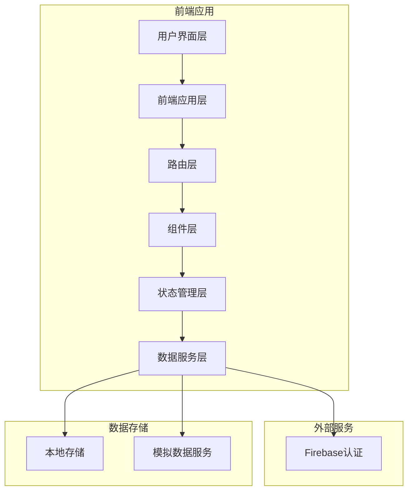
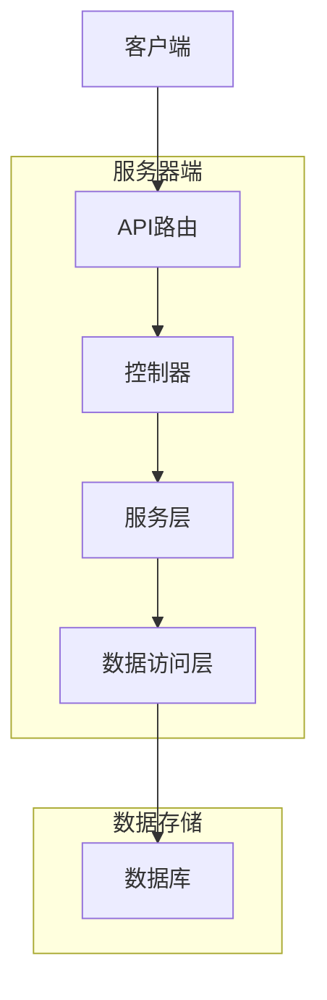
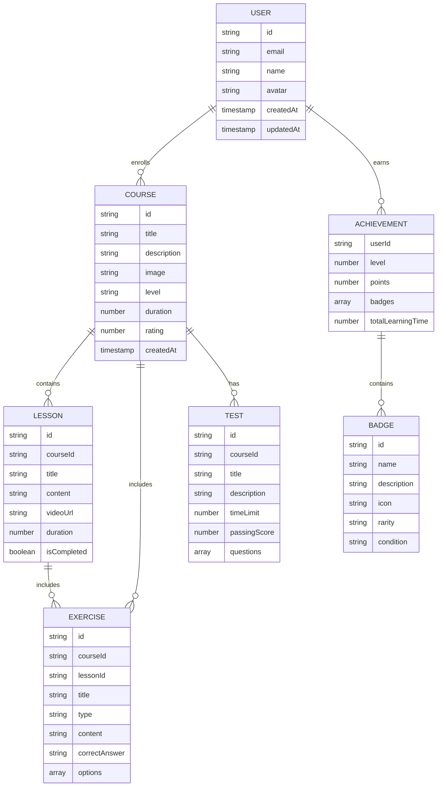

## 1. Architecture Design


## 2. Technology Description
- 前端：React@18 + TypeScript + Tailwind CSS@3 + Vite
- 路由：React Router v6
- 状态管理：Zustand
- 认证：Firebase Auth
- 代码编辑器：CodeMirror 6
- 图标：Lucide React
- 3D效果：Three.js (可选)
- 构建工具：Vite
- 部署：Cloudflare Pages

## 3. Route Definitions
| 路由 | 用途 |
|-------|---------|
| / | 首页 |
| /courses | 课程列表页 |
| /course/:id | 课程详情页 |
| /lesson/:id | 课时学习页面 |
| /exercise/:id | 练习页面 |
| /test/:id | 测试页面 |
| /achievements | 成就页面 |
| /profile | 个人中心 |
| /login | 登录页面 |
| /register | 注册页面 |

## 4. API Definitions
### 4.1 认证API
| 端点 | 方法 | 功能 | 请求体 | 响应 |
|-------|------|---------|---------|---------|
| /api/auth/login | POST | 用户登录 | { email: string, password: string } | { user: User, token: string } |
| /api/auth/register | POST | 用户注册 | { email: string, password: string, name: string } | { user: User, token: string } |
| /api/auth/logout | POST | 用户登出 | N/A | { success: boolean } |
| /api/auth/me | GET | 获取当前用户信息 | N/A | { user: User } |

### 4.2 课程API
| 端点 | 方法 | 功能 | 请求体 | 响应 |
|-------|------|---------|---------|---------|
| /api/courses | GET | 获取课程列表 | N/A | { courses: Course[] } |
| /api/courses/:id | GET | 获取课程详情 | N/A | { course: Course } |
| /api/courses/:id/lessons | GET | 获取课程章节 | N/A | { lessons: Lesson[] } |

### 4.3 学习API
| 端点 | 方法 | 功能 | 请求体 | 响应 |
|-------|------|---------|---------|---------|
| /api/lessons/:id | GET | 获取课时详情 | N/A | { lesson: Lesson } |
| /api/lessons/:id/complete | POST | 标记课时完成 | N/A | { success: boolean } |

### 4.4 练习API
| 端点 | 方法 | 功能 | 请求体 | 响应 |
|-------|------|---------|---------|---------|
| /api/exercises/:id | GET | 获取练习详情 | N/A | { exercise: Exercise } |
| /api/exercises/:id/submit | POST | 提交练习答案 | { answers: Record<string, string> } | { score: number, feedback: Record<string, string> } |

### 4.5 测试API
| 端点 | 方法 | 功能 | 请求体 | 响应 |
|-------|------|---------|---------|---------|
| /api/tests/:id | GET | 获取测试详情 | N/A | { test: Test } |
| /api/tests/:id/submit | POST | 提交测试答案 | { answers: Record<string, string> } | { score: number, feedback: Record<string, string>, passed: boolean } |

### 4.6 成就API
| 端点 | 方法 | 功能 | 请求体 | 响应 |
|-------|------|---------|---------|---------|
| /api/achievements | GET | 获取用户成就 | N/A | { achievements: Achievements } |
| /api/achievements/leaderboard | GET | 获取排行榜 | N/A | { leaderboard: LeaderboardEntry[] } |

## 5. Server Architecture Diagram


## 6. Data Model
### 6.1 Data Model Definition


### 6.2 Data Definition Language
#### 用户表
```sql
CREATE TABLE users (
  id TEXT PRIMARY KEY,
  email TEXT UNIQUE NOT NULL,
  name TEXT NOT NULL,
  avatar TEXT,
  created_at TIMESTAMP DEFAULT NOW(),
  updated_at TIMESTAMP DEFAULT NOW()
);

CREATE INDEX idx_users_email ON users(email);
```

#### 课程表
```sql
CREATE TABLE courses (
  id TEXT PRIMARY KEY,
  title TEXT NOT NULL,
  description TEXT NOT NULL,
  image TEXT,
  level TEXT NOT NULL,
  duration INTEGER NOT NULL,
  rating REAL DEFAULT 0,
  created_at TIMESTAMP DEFAULT NOW()
);

CREATE INDEX idx_courses_level ON courses(level);
```

#### 课时表
```sql
CREATE TABLE lessons (
  id TEXT PRIMARY KEY,
  course_id TEXT NOT NULL,
  title TEXT NOT NULL,
  content TEXT NOT NULL,
  video_url TEXT,
  duration INTEGER NOT NULL,
  FOREIGN KEY (course_id) REFERENCES courses(id)
);

CREATE INDEX idx_lessons_course_id ON lessons(course_id);
```

#### 练习表
```sql
CREATE TABLE exercises (
  id TEXT PRIMARY KEY,
  course_id TEXT NOT NULL,
  lesson_id TEXT,
  title TEXT NOT NULL,
  type TEXT NOT NULL,
  content TEXT NOT NULL,
  correct_answer TEXT NOT NULL,
  options JSONB,
  FOREIGN KEY (course_id) REFERENCES courses(id),
  FOREIGN KEY (lesson_id) REFERENCES lessons(id)
);

CREATE INDEX idx_exercises_course_id ON exercises(course_id);
CREATE INDEX idx_exercises_lesson_id ON exercises(lesson_id);
```

#### 测试表
```sql
CREATE TABLE tests (
  id TEXT PRIMARY KEY,
  course_id TEXT NOT NULL,
  title TEXT NOT NULL,
  description TEXT NOT NULL,
  time_limit INTEGER NOT NULL,
  passing_score INTEGER NOT NULL,
  questions JSONB NOT NULL,
  FOREIGN KEY (course_id) REFERENCES courses(id)
);

CREATE INDEX idx_tests_course_id ON tests(course_id);
```

#### 成就表
```sql
CREATE TABLE achievements (
  user_id TEXT PRIMARY KEY,
  level INTEGER DEFAULT 1,
  points INTEGER DEFAULT 0,
  badges JSONB DEFAULT '[]',
  total_learning_time INTEGER DEFAULT 0,
  FOREIGN KEY (user_id) REFERENCES users(id)
);
```

#### 徽章表
```sql
CREATE TABLE badges (
  id TEXT PRIMARY KEY,
  name TEXT NOT NULL,
  description TEXT NOT NULL,
  icon TEXT NOT NULL,
  rarity TEXT NOT NULL,
  condition TEXT NOT NULL
);

CREATE INDEX idx_badges_rarity ON badges(rarity);
```

#### 初始数据
```sql
-- 插入初始徽章数据
INSERT INTO badges (id, name, description, icon, rarity, condition) VALUES
('badge-1', '初出茅庐', '完成第一门课程', '🎓', 'common', '完成1门课程'),
('badge-2', '学习达人', '完成5门课程', '🌟', 'uncommon', '完成5门课程'),
('badge-3', '数据大师', '完成10门课程', '🏆', 'rare', '完成10门课程'),
('badge-4', '代码高手', '编写1000行代码', '💻', 'uncommon', '编写1000行代码'),
('badge-5', '测试冠军', '测试平均分90以上', '🥇', 'rare', '测试平均分90以上'),
('badge-6', '学习先锋', '连续学习7天', '🔥', 'uncommon', '连续学习7天'),
('badge-7', '知识渊博', '完成所有基础课程', '📚', 'epic', '完成所有基础课程'),
('badge-8', '数据科学家', '完成所有高级课程', '🧠', 'legendary', '完成所有高级课程');

-- 插入初始课程数据
INSERT INTO courses (id, title, description, image, level, duration, rating) VALUES
('course-1', 'Python数据分析基础', 'Python数据分析的入门课程，包括NumPy、Pandas等库的使用', 'https://trae-api-cn.mchost.guru/api/ide/v1/text_to_image?prompt=Python%20data%20analysis%20course%20cover%20with%20charts%20and%20code&image_size=landscape_16_9', 'beginner', 120, 4.8),
('course-2', '商务数据分析', '针对商务场景的数据分析方法和工具', 'https://trae-api-cn.mchost.guru/api/ide/v1/text_to_image?prompt=Business%20data%20analysis%20course%20cover%20with%20business%20charts&image_size=landscape_16_9', 'intermediate', 180, 4.7),
('course-3', '数据可视化', '使用Matplotlib、Seaborn等库创建精美的数据可视化', 'https://trae-api-cn.mchost.guru/api/ide/v1/text_to_image?prompt=Data%20visualization%20course%20cover%20with%20colorful%20charts&image_size=landscape_16_9', 'intermediate', 150, 4.9),
('course-4', '机器学习基础', '机器学习的基本概念和算法', 'https://trae-api-cn.mchost.guru/api/ide/v1/text_to_image?prompt=Machine%20learning%20course%20cover%20with%20AI%20concepts&image_size=landscape_16_9', 'advanced', 200, 4.8),
('course-5', '大数据分析', '处理和分析大规模数据集的方法', 'https://trae-api-cn.mchost.guru/api/ide/v1/text_to_image?prompt=Big%20data%20analysis%20course%20cover%20with%20large%20datasets&image_size=landscape_16_9', 'advanced', 240, 4.6);
```